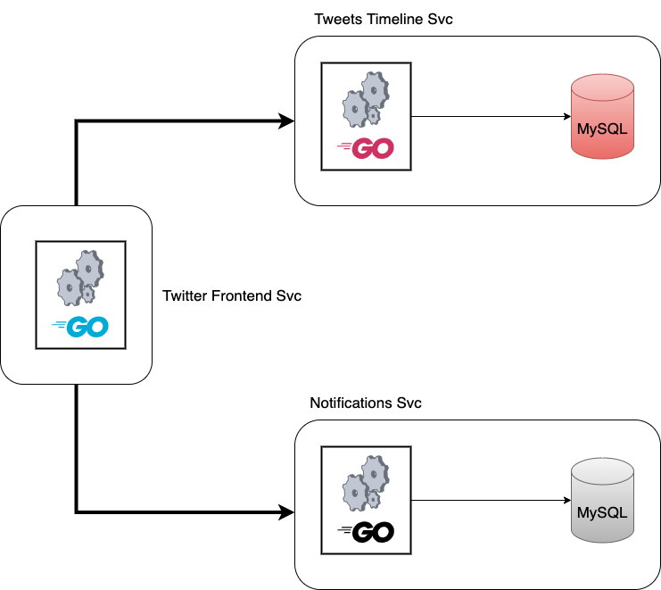

# otel-tryouts
otel-tryouts

# Svc Calls

# Instructions

1. Generate Newrelic's `Tracing/Insights` Key and update `NEW_RELIC_API_KEY` in `docker-compose.yaml`.

    1.1. (Go to [one.newrelic.com](https://one.newrelic.com/) > account dropdown > Account settings > API keys, and select Insights API keys. If you don't have a key, create a new one by selecting Insert keys +.)
2. docker-compose build && docker-compose up frontend backend-tweets backend-notifications
3. Go to one.newrelic.com and view the traces under `Distributed Tracing`. You should find traces like the one mentioned in [newrelic-tracing.png](newrelic-tracing.png) screenshot.
